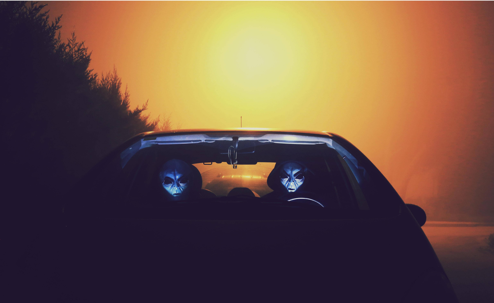

Mezopotamyanın kuzeyinde yer alan köyde ilginç olaylar serisi başlamıştı. E tabi düğünde başlıyor bunu unutmamak gerekir.

Cemal iki katlı bir viranenin üst katında çoban göçmeni olarak yaşıyor. İlk katı ahır olan evin, geceleri dışarı çıkılması zor olan bu muhitin de inanması güç olan efsaneler,  geceleri televizyon olmaması sebebiyle hızla yayılıyor ve hayaller gerçeklerin önüne geçmeye başlıyordu ki cemal sıkılıp aşağıya indi.

Allahtan korkuyor. Ama bir yaratıktan da korkacağı hiç aklına gelmemişti. Komşu hacı Halil’in viranesinde koyunların meeelemesi diğer meeelemeler gibi değildi. Aslında duyduğu bir iniltiydi. Hızla gelen bir trenin tuvaletindeki acil durum sifonunu çeken bir velet yüzünden ani frenin trenin demirlere yükü ve sürtünmesi ile oluşan o iniltinin bir benzeriydi.

Ama ahırda tren ne gezer.

Aldırmadı ama sigarasını yakmayıda ihmal etmedi. Sıkıntı sigarasıydı bu yaktığı. İniltinin geldiği hacı halilin viranesinin aksi yönünde ilerlemeye başlamıştı ki inltilerin artık bir karın tokluğu geğirine dönüştüğü o tuhaf sesi duydu.

Bu sesle biraz irkildi ve elindeki sigara yeri düştü. Sigarayı almak için eğildi ama yerler ıslaktı.

İçinden okkalı bir küfür salladı ve aksi yönde ilerlemeye devam etti.

Ayaklarının altında ki dere ove nin sesi kalbinde mutluluk kanlarının pompalanmasına sebep oldu ve bir sigara daha yaktı.

Bu yaktığıda mutluluk sigarasıydı.

-Eh bu seste fazla oldu dedi içinden ergenleğinin verdiği cesaret sesinini dinleyerek ahıra yöneldi.

Bir nefes çekti ve adımlarının hızlaştırarak ilerlemeye devam etti.

Ahırın kapısını açtı.

Samanlar kan revan içinde iki koyunun boğazından çıkan kanların gırtlakla temasında ki  o ses de,  bir an kurban bayramını hatırladı ama durumun vahametinin farkına vardı ve hemen ahırın kapısını kapattı korkuyla sigarası yine düştü bu korkuyla beraber.

Cemalin sigarasını düşüren tek şey korkuydu. Kapı kapandıktan hemen sonra arkasında iğrenç mahluk u gördü ve korkunun ne demek olduğu o muallak saniyeler de anladı ve kısa sürecek hayatının bu andan sonrasını
Bu saniyeleri düşünerek geçirecekti.

O şey az önce canı sıkıldığı için viranenin damında çayla birlikte götürülen efsanede anlatılan mahluktu.

İki saniyede bunları nasıl düşündüyse benim de 2 dakikada bunları yazmamda aynı şey.

Araya Hüseyin girmese belki daha da ilginçleşecek hikayemiz ama verdiği pnr numarasını pax sisteminde yazarak çıkardığım etiketin yazıcıdan çıkarkenki zzzzzz sesi beni biraz motive etti. Aslına bakarsanız yandaki ofisteki arkadaşın açtığı
 müziğinde etkisi vardı.

Hoş geldin bahar hoş geldin dostum şarkı sözleri motivemi arttırdı.

-Memelerinin yere sürtmesi nedir abi?
-Vallahi gördüm memeleri yere sürtüyordu?
-Abı sen dün cidden çayı fazla kaçırdın demek
-Yemin billah Halil sende bana inanmazsan ben ne yaparım?  Delimi oluyorum yoksa?
-yok ağabey estağfurullah…

Cemalin hacı Halil den duyduğu bu sözler aklına rüyamı gördüm yoksa deliriyor muyum? sorusunu dedirtti
Ama bu olanaksızdı rüyada hissedemesin. Ama bunu düşündükçe gece rüyalanmalarından sonra aldığı duş aklına gelir ve hissetmediysem cünup olmam olanaksız mantığını yürütüyor ve gördüğü mahlukun bir rüya
Objesi olmadığına bir daha inanmaya başlıyordu.

Hacı Halil ile bu konuşması ikisi arasında dere ove ye kadar susmalarına sebep oldu.

Dere ove köyün altından geçen debisi bir hayli yüksek köylülerin dere ove dediği ancak kayıtlarda köylülerin duymadığı bir isim olan atamersin nehri idi.

Kış aylarında balık tutulur . Yaz aylarında da köylüler  güneşin sıcaklığından sarı olan saçları az da olsa serinletmek için debisi yüksek olan dere ove ye beyaz köprüden atlar, 6 km ötedeki köy korucularının yuvalandığı pempe köprüye kadar kendilerini akıntıya bırakır böylece nehiri arkalarına alarak güneşe meydan okumaya çalılşırlardı.

Hacı Halil bu sessizliği bozarak bağırdı;

-Cemal Bak
Az ileride Cemallerin arsası olan lehke silme de ki totem  köyünden iki genç yerde yatıyor ama kıpırdamıyorlardı.

Cemal omuz silkti. Çünkü bunlar İbrahim ve Adem Mihrap kardeşlerdi. Onlarla daha iki gün önce dere ove  de kavga etmişti . Ama kavga Cemalin Mihrap ailesine saygısından sadece sözlü olarak ufak bir tartişmaydı aslında.

Mihrap ailesi yedi kişilik geniş bir ailedir. Geçmişlerinde çok acılar çekmiş çok kazık yemişler ancak bu kazıklar evin reisi olan Mihrap kardeşlerinin babası Ferruh u çok fazla düşünmeye ve bunun sonucu olarak tüm kazıklardan ders çıkararak 
Çocukların tamamını okutmaya adamıştı kendisini. 

Bunun için devletin koyduğu kuralı ve hatta köyün yoğun psikolojik baskısına göğüs germiş ve tüm çocuklarının okutmuştu.

İbrahim ve adem in üç ablası da üniversiteyi okumuştur. Fakat İbrahim ve adem sadece liseyi okumuş ve aile yapısı diğer köylülerden farklı bir yapıya dönüşmüştür. 

Mihrap ailesi kozmopolit bir aile yapısına sahipti. Diğer viranelerde kızların kesinlikle söz hakkı yokken Mihrap ailesinde evi yöneten aslında kızlardı. Çok zeki ve eğitimli olmalarının  hasebiyle diğer viranelerde erkek çocuklar
Büyük ablaları her istediğini yaptırırken Mihrap ailesinde bu mümkün değildi . Ama buna rağmen Mihrap ailesinin mutluluğu tüm köyün imrenerek bakmasına sebep oluyordu. 

Mihrap ailesinin kızları köyün ilk yüksek okul okuyan kızları olması ve okuduktan sonra da köyde atılım yaratmaları devletin dikkatinin çekmiş ve devlet bunun aksinin doğması için çok çaba sarf etmiştir.

Önceden devlet kızları başınıza bela olurlar orospu olurlar ve bunları askerler aracılığıyla köy halkına ulaştırması halk üzerinde takdire şayan bir başarı göstermiş, b,ir taşla iki kuş vurmuş ve hiçbir aile kızları ve hatta hiçbir çocuğunu okutmamaya karar vermiştir.

Ancak Mihrap ailesinin en büyüğü olan Resul un – hacıbaba diye tanınırdı- tüm torunlara daha çocuk yaşta yoğun dini eğitim vermesi çocuklarının kuran ahlakı ile ahlaklanmasına sebep oldu. 

Erkeklerden farklı olarak kızlar okumaya kendilerini adadılar.

İlk kuranı bitirdiler ardından nehçıran ı ardından mevlutu ardında da okula başladılar. 

Okulda büyük başarılar göstererek il birinciğini asla bırakmadılar ilkokul boyunca.
Aslında lise yılları da bundan farklı değildi ancak şehrin en büyük aşiret reisi erkek çocuğunu tüm lise hayatı boyunca topu topuna bir iki ay okula giden oğlanı sınavsız üniversiteye sokmak için kızların önüne kesmiş ve kızlar ikinci olmuştu.

Ama bu bile yıldırmamış üniversite sınavında daha büyük bir başarı göstererek ülkede ilk yüz e girmeyi başarmışlardır.

Cemal yerde yatmış olan İbrahim ve ademin yanına hareketlendi ve biraz daha yaklaşınca kırmızı sıvı başını döndürdü. 
Bu kandı. 

Yerde çok fazla kan ve ileride ki çalılıkta bir şeyler oynuyordu.

Hacı Halil çalılığa doğru yürümeye başladı cemal de çocukların nabzına baktı ikisinde yaşıyordu. 

İbrahim boğazından ağır yaralıydı ademin ise kasıkların çok fazla kan akıyordu.

Cemal bir haykırışla irkildi. Hacı Halil den geliyordu bu ses. Hemen ayağa kalktı ve dün gördüğü yaratığı rüya olmadığını şimdide karşısında olması ona gerçek duygusu tattırdı.

Hacı Halil in kafası dün gece ki yaratığın ağzındaydı . Cemal korktu kaçmaya başlayacaktı ki köy çok fazla uzaktı. Kune pire hacı Halil i n kafasını ağzında tutuyor ve cemale doğru yaklaşıyordu..

## Derinlik
-Birinin ölmesi gerekiyorsa bu ölüm defterine yazılır.
-İsmi yazılan kişinin  ne zaman öleceği 6 dakika içinde belirtilmezse kişi kırk dakika içinde ölür.
-Ölüm nedeni belirtilmeyen kişi kalp krizinden ölür. 
-İsmi yazılan kişi ismi yazılırken, ismi yazan kişi ölecek kişinin yüzüne bakarak yazması  gerekir. Bu aynı isimdeki kişilerin ayırt edilmesi için konulan bir kuraldır.
Bunlar tanrının koyduğu kurallar..

Ölüm meleğinin canı sıkılmıştı. Çünkü ölüm meleği diyarı pek sıkıcıydı. Diyarda ölüm meleklerinin sayısı çok az ve zaman kavramı olmadığından kimse yok olmuyordu. Yok olmaları için belli prensiplerin bilinmesi gerekiyordu. 
Ve bu prensipleri bilen tek varlık ölüm meleği tanrısıydı.

Ölüm meleğinin canı çok sıkılmıştı. Çünkü Ölüm meleği diyarı çürüyordu. Diğer tüm ölüm melekleri artık çok pasif ve uyuşuk olmuş ölüm defterinin hakkını vermiyorlardı.

Canın sıkılan ölüm meleği kendisinde iki tane olan ölüm defterinin insanların dünyasına atmaya karar verdi ve attı.
Defter Boğaziçi üniversitesi fen bilimleri fakültesi bahçesine düştü. Daha havadayken yere süzülüşünü camdan bakan Kurban gördü. 
Defterinin düştüğü vakitte fizik dersi olmalı kı kurbanın cama bakması şans olmasa gerekti. Aradan biraz vakit geçti ve hoca ders i bitirdi. Kurban defteri unutmuştu aklına bile gelmedi. Ama yurda gitmek için eve gitmeye hareket 
Etmeye başladıktan sonra bahçeden geçerken defteri gördü ve aklına geldi. Defteri siyah ve mat ama çok ağır olması onu biraz şüphelendirdiyse de zengin züppelerinden birinindir diye defteri aldı ve herhangi bir isim bulmak için sayfaları karıştırdı.

İlk sayfayı açınca mürekkepten farklı bişey ile yukarı da saymış olduğumuz kuralları gördü.

Diğer sayfalar da çok fazla isim yazılmıştı hepside farklı milletlerden insan isimleriydi . İlk anlamadı ama defterin ilk sayfasını açınca kuralları okuduktan sonra şok olduysa da eşek şakası veya bir çocuğun hayal gücü gibi şeyler düşünerek çantaya attı.

Yurda odasına çekilince saat gece yarısını çoktan geçmişti. Teleskopun başına geçti ve Venüs,  Neptün ve ay  aynı karede olması olması onu biraz keyiflendirdi. Hemen ben keşfettim deyip sosyal medyaya yazacaktı ki NASA nın açıklamasını gördü ve ufak bir hayal kırıklığına uğrasa da kendisinin haberlere bakmadan bunu keşfetmiş olması onu tekrardan motive etti.

Yarın ki final de kuantum fiziği soruları ağırlıkta olacaktı ve hiç çalışmamıştı. Hemen çantayı açtı sabah aldığı defteri gördü. Defteri açtı;

-Böyle saçma şeymi olur?
-Bu eşek şakasının yapanda kim?
-Bunlar kendini tanrı mı sanıyor ?

Omuz silkti . Ama merak onun kibrini yendi ve denemekten zarar gelmez düşüncesiyle onu en çok sıkan kişinin devlet başkanı olduğunu hatırladı. Ne de olsa gerçek değil düşüncesiyle internetten bir resmini bulup ismi yazdı.

Hiçbir şey olmadı. Hayal kırıklığıyla yatağa yattı. Ama Kurbanı uyku tutmamıştı ve mutfağa giderek bir ıhlamur kaynattı. 
Ardında tekrardan yatağa uzandı ve telefon eline aldı. Sosyal medyada biraz göz gezdirdi . Ve öyle bir irkilme geçirdi ki yataktan düştü.
Delirecekti neredeyse. Tıpkı  bin yıl önceden yanlışlıkla geleceğe yolculuk yapıp gökyüzünde uçan demirleri gören birinin şaşkınlığından farksızdı.

Çizgi roman çok eğlenceliydi ama köyden gelen seslerin dikkatini dağıtması yüzünden Kemal pencereden baktı.

Cemal sırtına Adem ve İbrahim mihrap kardeşleri almış sırtına kan revan içinde köyün merkezi olan havuza doğru sürünüyordu. Havuzun yanına yaklaşınca çeşmeyi açtı ve büyük bir çığlık sesi duyuldu. Cemal mikrop kapmasın diye İbrahim in boğazına suyu değdirince ibrahim in bağırmak istediği ancak kısılan sesi yüzünden ejderha çığlığına benzeyen bir ses ile bağırması  köyü bir anda ayağa kaldırdı. Topu topuna 16 hanesi olan köyün üç haneleri aşmayacak meraklı gözlerin hepsinin  aynı manzara karşısında  gösterdiği şaşkınlık yansımasındaki 3 insanın kırmızıyla dansından bariz belli oluyordu.

Ama bu fotoğrafta biri eksikti o da hacı Halil. Cemal en son onun kafasının kopmuş olduğunu görmüştü. Gördüklerini köy halkına anlatmak istiyordu ama hacı halile anlattığında hacı Halil in verdiği tepkiyi düşündükçe buna cesaret edemiyordu. 
Bütün maneviyatını bütün duasını bütün ruhunu sadece Mihrap kardeşlerin yaşamasına adamıştı. Canla başla bir şeyler yapmaya çalışıyor ancak meraklı gözlerin gördükleri sadece bir takım deli hareketleri yapan Cemal in nasıl bir anda böyle olduğuydu. 
Bu hareketler meraklı gözlere Mihrap kardeşlerin durumunun ne olduğunu kimin böyle canice bir saldırı yaptığı sorusunun cevabını veriyordu. 
Acaba Cemal mi yapmıştı?

----
Kemalin canı sıkılmıştı çizgi romanı okurken dikkati dağılması yüzünden. Havuzun orada neler olur bittiğini öğrenmek için ayağa kalkmaya çalıştı ama çabası boşunaydı.Hava kararmaya başlamıştı artık havuzu bile göremeyecekti birkaç dakikaya kadar. Yürüyemediğini unutmuştu. Aslında yürüyemediğini unutmak için kitaplara sarılmıştı. O kadar üzücü  fiziki ve akli nimetlerden yoksun insanların hikayesini okudukça sadece ayağının olmamasına şükrediyordu. 

Şimdi ne yapsa boşunaydı evde kimse kalmamıştı. 
Kemal bundan öncede evde tek başına kalmıştı ama bu sefer farklıydı. Tek başına kaldığında gaip ten sesler duyuluyordu. Sonuçta köydü burası kuzu, rüzgar, horoz, tavuk ve böcek seslerinin gelmesi çok normaldi. Hatta bazen öyle çığlıklar geliyordu ki yeryüzünde öyle ses çıkaran bir varlığın olmasına ihtimal vermiyordu Kemal. 

Nefes sesi geliyordu hemen yaslandığı duvarın arkasında ki odadan. Kimsenin evde olmadığına da emindi.

Ama birden kapı açıldı. Kemal o gördüğü mahluk un ne olduğunu anlamaya çalışıyordu. Beyninde ki nöronlar o kadar hızlı hareket ediyordu ki nöronların hızı kafasından sanki yanan bir motorun hararet yapmasından sonra çıkan duman gibi bir koku hissetti kafasın da.

Bu kısacık saniyeler için de Kemalden gelen çığlık meraklı gözler güruhunu kemallerin evine yönlendirdi. Kemal uyku ilke uyanıklık arasında yastığının altından çıkardığı muskayı boynuna atacaktı ki kune pirenin elinin yastığını altından çekmesiyle irkildi.
Kune pire kapıda duruyordu. Ve eli o kadar uzundu ki tek elini uzatmasıyla yastığı Kemal’in altında ki yastığı alması bir oldu.

Ve bir haykırış yükseldi bir anda. Havuz başında ki meraklı gözler birden  Kemal in olduğu eve çevrildi.
O kadar hızlı koştu ki köylüler yerdeki toprak iki metre yükseklikte toz bulutu oluşturmuştu.

Evden içeri  ilk Reyhan girdi. O kadar çok seviyordu ki çocuğunu kılına zarar gelmesini göze alamıyordu. Gerçi babası çok fazla sevmiyordu. Hektarlarca arazisi olmasına rağmen evde işe yaramaz bir erkek ne kadar sevilebilirdi ki. Bu babasının savunmasıydı. Ona göre erkek çocuk yatırımdır. Ancak Kemal onun için külliyen zarardı. Sofrada ki artı bir tabak olmasına rağmen tabağın sahibinin yemeği hak edecek hiçbir şey yapmaması onu içten içe Kemal den soğutuyordu.

Reyhan kapıyı açtığında pembe köprünün yanında yuvalanan köy korucularının yemekten sonra bıraktıkları atıkların pis kokusu gibi bir koku geldi burnuna. Ama Kemalin kokusu yoktu ne yazık ki.

