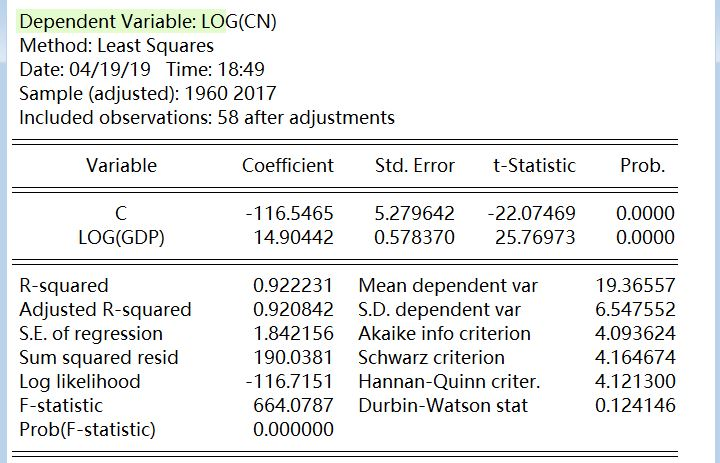

---
title: Basit regresyon analizi
tags: ["eviews, regresyon analizi,"]
cover: analysis.jpg
author: ibrahim karavas
---

Burada basitten kasıt **tek değişkenli** regresyondur.

**Peki bu ne demektir?**
>Bu ceteris paribus'tur. Bu hakim neoliberal paradigmanın mihenk taşıdır. (daha sonra buna değineceğiz.)

*Eviews üzerinden uygulama gösterelim; İleride göreceksiniz ki bir    sosyal bilim olan iktisadın diğerlerinin aksine cebirsel olarak ifade edilmesi sizi şaşırtacaktır.*

## Tüketim Fonksiyonu
>
> C=f(Y) (1)
>
> C= α + cY (2)
>
> C=tüketim, Y,=gelir

  Defalarca ekonometrik olarak benim kanıksadığım ve sosyal bilimlerde ki belki de en iyi açıklama gücüne sahip bir denklemdir diyebiliriz.  Sosyal bilimlerin e=mc²'si.

Burada değişkenlerimizin logaritmasını aldık, aksi takdirde yorumlamalar büyük sayılar üzerinden ve birim değişim üzerinden yapılacaktı. Buna daha sonra değineceğiz.

> _LOG(CN) = -116.546488649 + 14.9044235571*LOG(GDP)_

Görüldüğü gibi otonom harcamalar negatif bir durum sergilemiştir. Demek ki **stok tasarrufların tüketimi** söz konusu.
**C=a+cY**

**1** Nolu denklemde gelirin yanında bulunan **c** katsayısı mc'dir. Yani 14,90 olarak gördüğümüz bu katsayı marjinal tüketim eğilimi olarak anlamlandırılır ki, anlamı gelirdeki bir birimlik veya yüzdelik artışın (onluk tabanda) ne kadarının tüketime gideceği sorusuna cevap verir.
Bu durumda gelirdeki yüzde birlik bir artışın 0.14 kadar miktarı tüketime gitmektedir.

Henüz daha yeni başlayanlar için ekonometrik ilişkilerin içeriğine dair pek açıklama yapmayacağız. Fakat en azında **equation** ekranı ile tanışık olmak için bazı durumlara değineceğiz.

### Rkare

Bu ifade açıklayıcı değişkenlerin (yani x yatay ekseni) Y ekseninde bulunan bağımlı değişkenin açıklama gücünü ifade eder.
"Kurduğumuz C=a+cY modelinin açıklama güzü %92dir, ki bu oran sosyal bilimlerin diğer sosyal bilimler karşısında ki üstünşüğünü gösterir.

### Prob

Olasılık değerleri boş hipotezin redddilme oranını gösterir.  Modeldeki değişkenler üzerinde kurulan hipotezler şöyledir;

>h0: a=0 c=0
>
>h1:aksi durum
>
yani ikisinden biri mutlaka modelde değil.
Ekonometride biz genelde %95 kesinlikle analiz yaparız.
