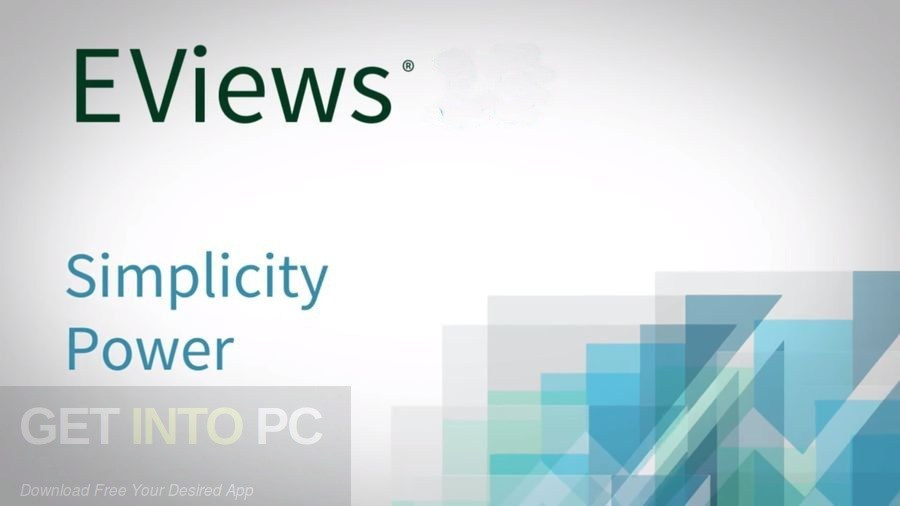

---
title: E-views 10 Enterprise Kurulum 
tags: ["eviews10", "yazılım", "econometrics"]
cover: evi.jpg
author: İbrahim Karavaş
---

Daha önceki yazımızda basit regresyondan bahsetmiştik.  Bir an önce herkes programlara sarılıp bunu denemek istedi biliyorum.
Benim kullandığım eviews 10 versiyonudur. Bir kaç arkadaştan gelen mail üzerine buraya **eviews 10 enterprise** versiyonunu nasıl yükleyeceğinizi anlatıyorum.

 1. Öncelikle yapmanız gereken one drive'a yüklediğim [***bu dosyayı indirin***](https://iuedu-my.sharepoint.com/:f:/g/personal/ikaravas_ogr_iu_edu_tr/EmFZeDWLJDpJp2KSEdFQnDUBMp5V1RuugKblvvbZZsbLlQ?e=SwC7q6)
 2. İnterneti kapatın. Varsa güvenlik duvarını etkisiz hale getirin. Bazı virüs programları sorun çıkarabilir.
 3. Setup'u çalıştır. (next-next...). Orada bize giriş bilgilerini isteyecek. Kullanıcı kısmına ***demo*** yazın.
 4. Kurulum bittikten sonra programı çalıştırmayın.
 5. Patch dosyasını yönetici olarak çalıştırın. Ve patch'leyin. (patch tuşunu bas. Sonra kapat)>
> ***Nur topu gibi bir eviews 10 enterprise sahibi oldunuz..***
>
**Verimli çalışmalar..**
