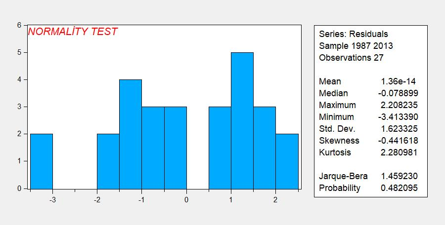

## Burada Eview's ile bir genel uygulamalı bir ekonomi analizi yapacağız
Başlıkta söylenildiği gibi bir analiz için  [**burada**](https://iuedu-my.sharepoint.com/:f:/g/personal/ikaravas_ogr_iu_edu_tr/EknRAqmsuc1Mu3U07ztAp60Be-Mowmup14pXbTAKuagtDQ?e=RPck1U) kullanacağımız eviews dosyasını indir.

**Adım adım regresyone analizini takip edin?**

>Bu ceteris paribus'tur. Bu hakim neoliberal paradigmanın mihenk taşıdır. (daha sonra buna değineceğiz.)

*Eviews üzerinden uygulama gösterelim; İleride göreceksiniz ki bir    sosyal bilim olan iktisadın diğerlerinin aksine cebirsel olarak ifade edilmesi sizi şaşırtacaktır.*

