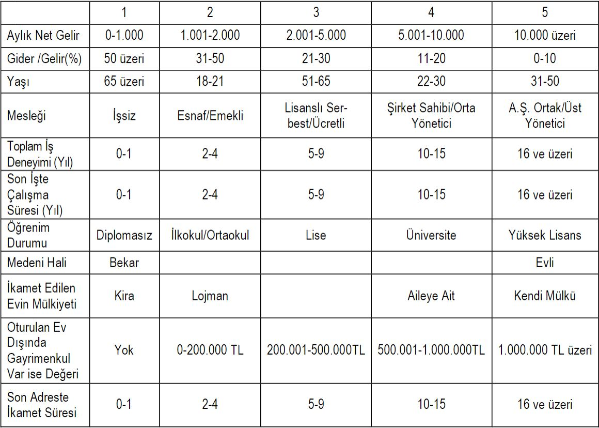
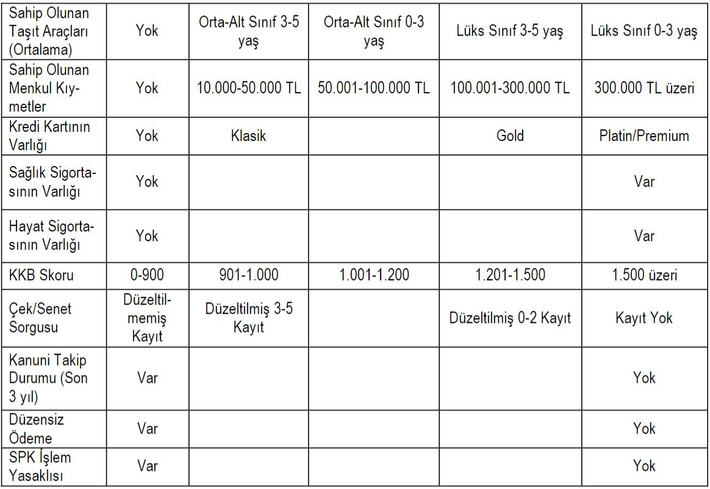
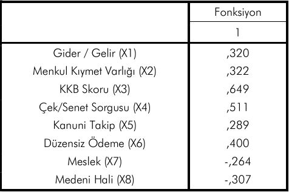

---

title: Kredi Skorlama
tags: ["deneme, makale"]
cover: image.jpg
author: İbrahim Karavaş

---

Kredi riskinin doğru değerlendirilmesi kredi veren kuruluşlar için son derece önem taşımaktadır. Kredi skorlama, kredi başvurusunda bulunan kişinin varsayılan finansal yükümlülüğü üzerinde tutabilme ihtimalini tahmin etmek ve kredi vermek veya vermemek yönündeki karar için finansal kurumlar tarafından gerçekleştirilen analizlere yardımcı olarak yaygın kullanıma sahip bir tekniktir.

 Başvuru sahibinin kredi skoru veya değerliliği üzerindeki kesinlik kazanan karar olası kayıpları en aza indirerek finansal kurumların kredi verme hacmini arttırmaya yardımcı olmaktadır. Kredi hacmi son yıllarda muazzam bir büyüme yaşamıştır. Potansi  yel başvuru sayısının artması kredi onay prosedürünün otomatikleşmesini ve borçlunun finansal sağlığını denetleyen ileri tekniklerin gelişmesine yardımcı olmuştur. Kredi portföylerinin büyük hacimde oluşu ve kredi skorlamadaki doğruluk oranının artması beraberinde finansal kurumlar için önemli kazançları da getirmiştir.

Bankalar, kredi talep eden müşterilerine kredi vermeden önce çeşitli kredi değerlendirme modellerine başvurmaktadır.

Kredi talebinde bulunan müşterilerin kredi isteğinin onaylanması veya geri çevrilmesi kararının verilmesini kolaylaştıracak bir sistemler geliştirilmiştir.

## KREDİ SKORLAMADA MÜKEMMEL MÜŞTERİ

Kredi talep edenin riskinin hesaplanmasında kullanılan ölçütler, talep edenin tüzel ve gerçek kişi olmasına göre değişmektedir. 

### Bireysel Kredi İçin Ölçütler

-   Aylık Düzenli Net Gelir
-   Aylık Gelir/Gider Oranı
-   Yaş
-   Meslek
-   Toplam  İş Deneyimi
-   Son İşte Çalışma Süresi
-   Öğrenim Durumu
-   Medeni Hali
-   İkamet Edilen Evin Mülkiyeti
-   Oturulan Ev Dışında Gayrimenkul Varlığı
-   Son Adreste İkamet Süresi
-   Sahip  Olunan  Taşıt Araçları
-   Sahip Olunan Menkul Kıymetler
-   Eski Kredi Başvurusu
-   Sağlık Sigortasının Varlığı
-   Hayat  Sigortasının Varlığı
-   KKB Skoru
-   Çek/Senet Sorgusu
-   Kanuni Takip Durumu
-   Düzensiz Ödeme
-   SPK İşlem Yasaklısı Kaydı

Kullanınlan değişkenler genel olarak yukarıda ki gibidir. Fakat veri madenciliğinin gelişmesi ile alışık olmadığımız başka değişkenlerde kullanılmaya başlamıştır. Bu değişkenleri buraya eklemeyi isterdim, fakat ticari sebeplerin varlığından dolayı risk ölçme faaliyeti içinde olan hiç bir firma bunu açıklamaz. Açıklasa bile sadece tümevarımın uç noktasını ifade eder.

> Bu değişkenlerin anlamlı sonuçlar vermesi için kullanılan **istatistiki yöntemler** ise en az değişken sayısı kadar çeşitlidir. Bunlar;
- Diskriminant Analizi
- İki Grup Diskriminant Analizi
- Lojistik Regresyon
- Kümeleme Analizi
- Sınıflandırma Ağaçları
- Yapay Sinir Ağları (YSA)
- Doğrusal Programlama
- Tamsayılı Programlama

### Diskriminant Analizi

Diskriminant analizi; belirli aralıklar ile tanımlanmış kategorik olarak belirlenen bağımlı ve bağımsız değişkenler arasında fonksiyonel bir ilişki kurarak gruplar arası ayırımı sağlayan bir data analiz tekniği olarak tanımlanır.

##### Temel Görevi
- Grupların birbirinden ayrılmasını sağlayan bir model kurmak
- Yeni gözlemeleri uygun sınıflara yerleştirmek

> Diskriminant analizi, **hatalı sınıflandırma olasılığını en aza indirerek birimleri n sayıdaki özelliğe dayalı **olarak sınıflandırmak amacıyla kullanılan istatistiksel bir yöntemdir.

Yapılan çalışma sonucunda analize katılan 21 değişken içerisinde 8 değişkenin doğru ayırma gücü %92,5 olup, bu değişkenler içerisinde KKB skorunun 0,649 katsayı ile en yüksek açıklama gü- cüne sahip olduğu görülmüştür. 

> Z = 0,320(X1) + 0,322(X2) + 0,649(X3) + 0,511(X4) +
0,289(X5) + 0,400(X6) - 0,264(X7) - 0,307(X8)

Uygulamada da yaygın olarak kul- lanılmakta olan KKB skoru, müşterinin zamana yaygın olarak ban- kalar ile ilişkilerindeki davranışlarını değerlendirmekte olduğundan, özellikle hızlı karar almanın gerekli olduğu kredi kartı taleplerinin değerlendirilmesinde en önemli bağımsız değişken olarak analizde öne çıkmaktadır.

KKB skoruna yakın önem arz eden bir diğer bağımsız değişken ise, müşteriye ilişkin istihbari kayıtları içeren 0,511 katsayıya sahip çek/senet sorgusudur.

> Son üç yıl içerisinde en az 1 adet olumsuz istihbarat kaydı bulunan müşterilerin sorunlu olma ihtimali de artmakta ve ayrıştırma gücü yüksek bir değişken olarak öne çıkmaktadır.
Analiz sonuçlarına göre üçüncü sırayı ise 0,400 katsayı ile KKB’den alınan ve müşterinin üst üste iki dönem ödeme aksaklığının olup olmamasını gösteren düzensiz ödeme bağımsız değişkeni almaktadır.

#### Sonuca İlave
-------------------------------

> Veri Madenciliği kredi skorlamada günden güne finansal camiada saygı görmeye başlamıştır. İnovatif skorlama şirketleri ile birlikte yeni değişkenlerin eklenmesi  yüksek tahmin değerlerine sahip kredi skor raporlarını çok uluslu şirketler ve finans dünyası tarafından çok cazibeli hale getirmektedir.

Kaynaklar

- ALTMAN Edward I, Financial Ratios, Discriminant Analysis and the Prediction of Corporate Bankruptcy, The Journal of Finance, V:23, n:4, September 1968, pp.589-609.

- YAZICI, M . (2011). KREDİ KARTI TALEPLERİNİN DEĞERLENDİRİLMESİNDE DEĞİŞKEN ANALİZİ. Maliye ve Finans Yazıları, 1 (90), 9-22. Retrieved from http://dergipark.org.tr/mfy/issue/16290/170810

- PEKKAYA, M , ASLAN, B . (2018). OSB YER SEÇİMİNDE DİKKATE ALINAN KRİTER ÖNEM DERECELERİNİN VE KRİTERLER ARASI ETKİLEŞİMİN BELİRLENMESİ. Uluslararası İktisadi ve İdari İncelemeler Dergisi, (), 293-308. DOI: 10.18092/ulikidince.353378

- Tabagari, Salome. Credit scoring by logistic regression. Diss. Tartu Ülikool, 2015.
- Sousa, Marcos de Moraes, and Reginaldo Santana Figueiredo. "Credit analysis using data mining: application in the case of a credit union." JISTEM-Journal of Information Systems and Technology Management 11.2 (2014): 379-396.
