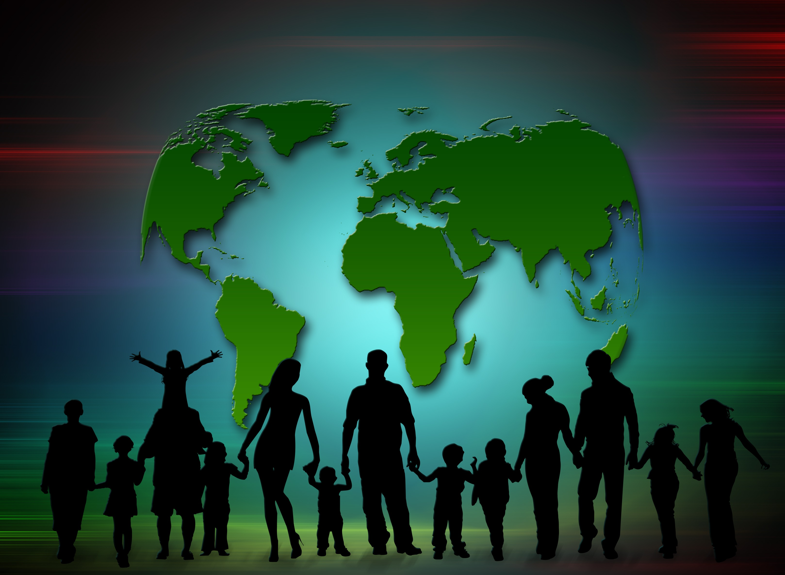

---

title: Kimlik Meselesi |gazetecilik| Medya Etik'i Üzerine
tags: ["deneme, ethics, media"]
cover: image.jpg
author: İbrahim Karavaş

---
# (!) geleneksel ve gelecekler gazeteciler 

Medya etiği kavramı daha önce tartıştığımız etik alanlarından ayrışır. Siyaset etiği, tıp etiği, biyoetik vs.. Çünkü, kâr amacı güden bir tavır sergilemesinden dolayı bir işletme statüsünde kalır. Fakat tabi kar     amacı gütmeyen medya kuruluşlarını tenzih ederim. Biz genel olarak işçi üzerinde tartışacağız.

Medyanın işçileri olan gazetecilerin ahlakı kuruluşun kalitesini her zaman yansıtmıştır. Hemen bir pratik yapmak yapaılım. *Şuan ülkemizde faaliyet gösteren geleneksel yayın organlarının hangisi en kalitelidir?*

Ben gazetecelik mesleğine bir kimlik meselesi olarak bakarım. Gazeteci yetiştirme fabrikasından çıkmış bir gazetecinin bu sıfatı haketmesi için bir pirensiplerde kendini kanıtlamış olması gerekir. Kimlik meselesinden kastım budur.

## Peki prensipler nelerdir?

**Gerçeklik ve Nesnellik:**

Gerçeğin peşinde koşan bir gazetececi, eğer ki bu gerçeklik habere konu olan sınıf ve kişilerin varlığına bir tehdit oluşturursa, güç kimde ise onun lehine bir sonuç çıkacaktır. Bu durum süreklilik kazanmışsa zaten o coğrafyada kurumsallıktan bahsetmek afaki kalır. Bu aşamada yukarıda bahsettiğim gazeteci kimlik meselesi haline getirmişse mesleğini endişesi varoluşşsal olur ve ya hep ya hiç diyerek savaşır. Epistemolojik olarak gerçekliği anlamak burada pek uyuşmuyor sanki. Herkez kendi gerçekliğinde yaşarken nesnelliğin gücü gerçeklikte bir güçlendirme görevi görüyor şahsımca.

**Adalet:**

Mevcut gündem sürer giderken, bir tarafta bir kesimin bağırışları duyulmaz. Gündemin yoğunluğundan sesi çıkmaz,çıksa da duyulmaz. Hakkaniyet nezdinde sesi çıkmayanların sesi olması gerekir. Sesi çıkmayanların sesi olması için ona verilmiş anayasal hakları kullanmayan bir medya işçisinin gazeteci sıfatını kullanması değersizdir. 

**Toplumsal Sorumluluk:**

 Adalet prensibi çatısı altında vuku bulur toplumsal sorumluluk. Adalet yetisi ne kadar güçlü ise o kadar güçlü olur bu prensip.

**Mahremiyet:**

Mahremiyete saygı bir gazeteciyi tam olarak gazeteci yapar. Aldığı bilginin kaynağını hiç bir şekilde ifşa etmeyen bir gazetecinin sesi diğerlerine göre oldukça gür çıkar. Çünkü bilginin gizliliği ve genel ilgisi ne kadar yüksekse hassasiyeti de yüksek olur. Bu bilginin kaynağı olan kişi, ancak ve ancak bilgiyi bu prensibe saygı duyan gazeteciye açacaktır.
