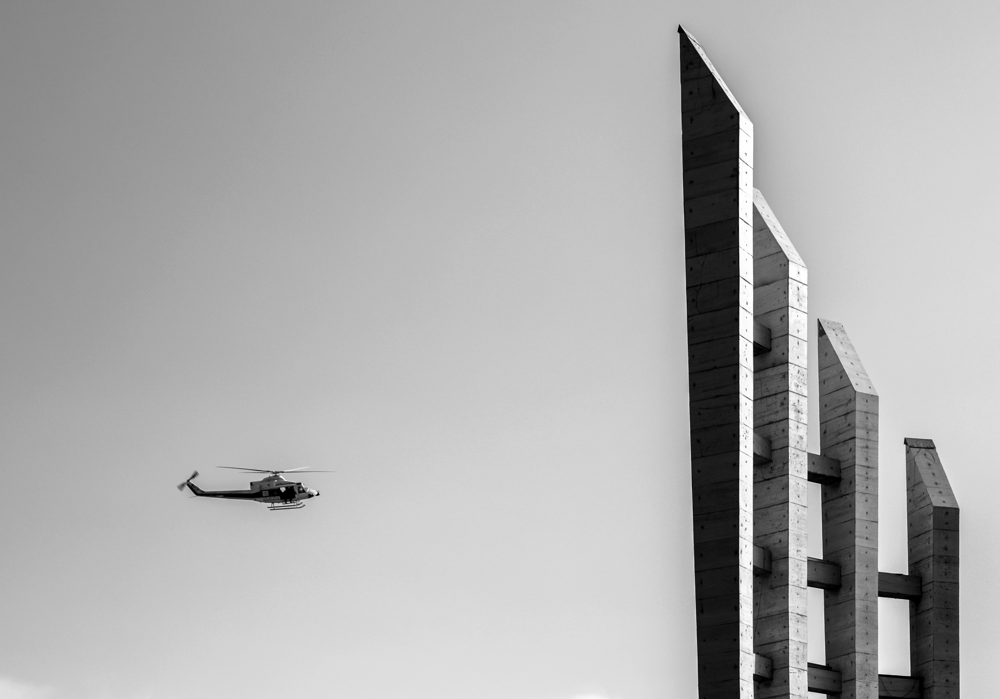

---

title: Sivil İtaatsizlik
tags: ["deneme, makale"]
cover: image2.jpg
author: İbrahim Karavaş

---
## Adalet
Adalet üzerine düşünmek ve yargılama yapmak hukuk eğitimi almayı gerektirmez. Bir form olarak **adalet** yoğun düşünsel aktivite geçmişi gerektirir. İstisna olsa dahi kişi bu yeni yolculukta bulduğu cevaplardan tatmin olacağını tahmin etmiyorum. 

Yüce bir amaç için araçsallığın meşruiyetini savunan Raskonikov'u hatırlatalım. Suç analizi için, bir katilin hislerini topluma anlatmak için katil oluyor. Bu gerçekten toplum yararına mıdır? 

**Machievellie** ile benzerlik taşıdığını hissederdim daha önceleri Raskolnikov'un. Fakat çok net farklılıkları olduğunu anladım şimdi. Öncelikle Raskol kesinlikle bir dava adamıdır. Machievellie ise dava adamlığından ziyade bir bukalemun misali değişime ayak uyduran bir bürokrasi adamı.

İlkinin gerçeğe ulaşma güdüsü var. İkincisinin öyle bir amacı yok, sadece ortam adamı, develetin sürekliliği gibi şeylerin rastsallığa bırakıldığı bir durum.

## Suç Nedir?

Rus klasiklerinden başlayarak bu soruya cevap vermeye çalıştım. Dostoyevski'nin Savaş ve Barışı, Karamazov Kardeşleri ve hatta Yeraltından Notlar beni bir cevapta tatmin etmese bile, kritik düşünce olarak **suç** kavramının canına okudum diyebilirim. Delik deşik ettim.

Suç'u hep sınıflandırmaya çalıştım. Zaten sınıflandırılmış olarak bana veirilmişti. Ben sadece sorguladım, ateş ettim. Yanlış yaptım. Suç sınıflandırılamaz. Suç gerçekten sınıflandırılamaz. Verilen dehşet asla suç büyüklüğünü tarif edemez.

## Leviathan

En büyük suçlu potansiyeline sahip tüzel kişilik-form. Ve iddia ediyorum en çok suç işleyen Ezer geçer, seni de beni de. Fakat ona karşı savaş durumunda kesinlikle tek taraflı kaybeden ben olmayacağım. Onu islah edeceğim.

## Yargı

Yargıda yenilik nedir?

## İnsan

Eğitilecek. Edilgen özne kesinlikle insan olmamalı. Soyut bilim olmalı.

## Dava

Ya özgürlük ya ölüm...
